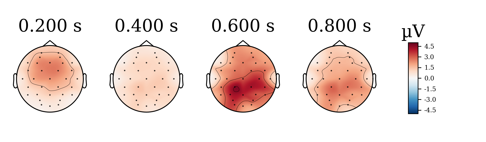

<h1> Bayesian Multivariate Gaussian Random Walk Regression for ERP Estimation with LKJ prior </h1>

	The present analysis implements a multivariate Gaussian random walk (MGRW) using a Lewandowski-Kurowicka-Joe (LKJ) prior distribution for estimating event-related potentials (ERPS).  

<h1> Model </h1>

 The present model attempts to estimate event-related potentials (ERPs) across the whole epoch and capture electrodes covariation/correlations at the same time. To that aim, we use an MGRW prior to model the voltage changes across time plus a Gaussian noise parameter. We reparametrised the gaussian random walk by simplifying to the assumption of an independent random walk per electrode, related via the covariance of a multivariate Gaussian. So that we could write the GRWs in the form &beta; = w&sigma;t, where w ~ Normal(0,1), sigma ~ HalfNormal(1) being a second moment parameter, and t = &Sqrt;times (i.e. the squared root of each of 295 sampled times from the start fo the baseline time0 to the end of the epoch timeS, S=295). Covariance is modelled as a Cholesky decomposition, where the Cholesky factor comes from a LKJ prior. A normal distribution (likelihood) is used for the observed voltages with a half-normal distribution as error parameter. 

 L1...LC, &rhov;1...&rhov;C, SD1...SDC = LKJ(n=E, &eta;=6)

 &Sigma;1...&Sigma;C = LcLcT 

 w1... wC ~ Normal(0,1) , S &times; E 
	 

 <em>&sigma;</em>1... <em>&sigma;</em>C ~ HalfNormal(1) , S &times; 1 

 tc,s = &Sqrt;timec,0... &Sqrt;timeC,S 

 &beta;c = wc&sigma;ctc 

 B = &Sigma;c&beta;c , E &times; S 

 &alpha;c,s ~ Normal(0, 1) 

 &mu;c = &alpha;c,s + B 

 &varepsilon;c ~ HalfNormal(0.05) + 1 

 yc ~ Normal(&mu;c, &varepsilon;c) 

 Where C = 4 mandarin tones (tone 1... tone 4), E = EEG electrodes (32), and S = number of samples (282, 100ms baseline, 1s epoch). Data comes from a tone detection oddball task (Tone 4 was the deviant target, 25% of total stimuli), completed by learners and non-learners of Chinese Mandarin. We fit two models, as described above, to data from each group: learners and non-learners. 

 We sampled the model using Markov chain Monte Carlo (MCMC) No U-turn sampling (NUTS) with 2000 tuning steps, 2000 samples, 4 chains. The model sampled well, with 1.01 > R&#770; > 0.99; BFMIs > 0.9, and bulk ESS > 1000 for all parameters (few parameters, 3-6 per model, however, were below 500 effective samples; which may indicate some sampling issues). Note that due to the high number of parameters, the trank/ folder contains traceplots and autocorrelation plots from parameters below 10% (1600) ESS instead (these plots show good mixing). 

<h1> Results </h1>

 The estimates from learners indicate that the target tone (tone 4) induced a strong positive voltage deflection after ~200ms respect to the non-target tones at Pz (i.e., tone 4 induced a P3b). Image below shows the contrasts between tone 4 and each other tone from posterior distributions. 

	

 The estimates from non-learners indicate that the target tone (tone 4) induced a milder positive voltage deflection after ~200ms respect to the non-target tones at Pz. Image below shows the contrasts between tone 4 and each other tone from posterior distributions. 

	

 Predictions from the posterior for learners indicate more uncertainty but the P3b is still present. Image below shows contrasts between tone 4 and each other tone from Pz predictions. 

	

 Predictions from the posterior for non-learners also indicate more uncertainty but there is still a mild P3b. Image below shows contrasts between tone 4 and each other tone from Pz predictions. 

	

 Images below show posterior distributions from the learners’ model as scalp topographies (posterior of tone 4 minus all other tones combined). 

<strong>5% highest density intervals (HDI)</strong>

  

<strong>Posterior means</strong>

  

<strong>95% highest density intervals (HDI)</strong>

  

 Images below show posterior distributions from the non-learners’ model as scalp topographies (posterior of tone 4 minus all other tones combined). 

<strong>5% highest density intervals (HDI)</strong>

  

<strong>Posterior means</strong>

  

<strong>95% highest density intervals (HDI)</strong>

  

 Correlations across electrodes per tone indicate that the target tone (Tone 4) shows strong correlations between the electrode showing maximum P3b amplitude Pz and surrounding electrodes (PO4, PO3, P4, P3, CP1, CP2). Pz is also moderately anticorrelated with frontal electrodes (as commonly observed for P3b). Differently, non-target tones show very low correlations and anti-correlations. This may indicate that these tones do not generate a P3b, i.e. their activity remains around zero independent of scalp topography, as electrodes do not capture activity corresponding to an elicited ERP. Images below show topomaps of correlations to Pz. 

<h3 align="center"> Learners: correlations to Pz </h3>

  

<h3 align="center"> Non-learners: correlations to Pz </h3>

  

<h1> Conclusion </h1>  

 The estimates show that there is a difference of P3b amplitude between learners and non-learners, but predictions remain somewhat uncertain. The present model includes a correlation matrix for electrodes, solving one problem from our previous model (https://github.com/ebrlab/Bayesian_MGRW_LKJ_ERP). However, there are minor sampling issues that may require more work on priors. Further work on developing a scientific model which can better model voltage activity is a relevant additional step. 
 